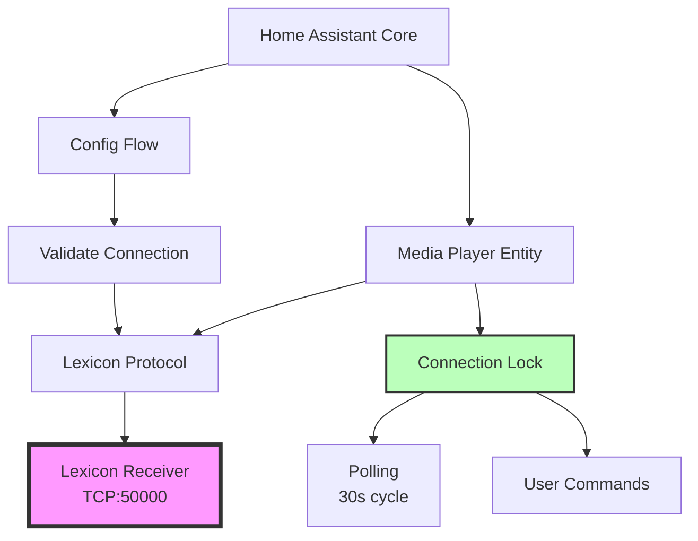

# Lexicon AV Integration v1.8.0 - Backlog

**Release Goal:** Polish, Testing, and Developer Experience Improvements
**Target Date:** Q1 2026
**Priority:** Quality & Maintainability

---

## 🎯 Release Theme

v1.8.0 focuses on **engineering excellence** without adding new features:
- Automated testing infrastructure
- Type safety improvements
- Code quality enhancements
- Developer experience upgrades

**Philosophy:** Build the foundation for sustainable long-term maintenance.

---

## 📋 Epic 1: Testing Infrastructure 🔴 CRITICAL

**Goal:** Establish comprehensive automated testing to prevent regressions and improve confidence in releases.

### Task 1.1: Set Up Testing Framework

**Priority:** 🔴 Critical
**Estimated Effort:** 4 hours
**Dependencies:** None

**Description:**
Set up pytest framework with Home Assistant test utilities.

**Acceptance Criteria:**
- [ ] `pytest` and `pytest-asyncio` added to dev dependencies
- [ ] `tests/` directory structure created
- [ ] `conftest.py` with common fixtures
- [ ] `tests/__init__.py` with test helpers
- [ ] Test discovery working (`pytest tests/`)

**Files to Create:**
```
tests/
├── __init__.py
├── conftest.py
├── test_const.py
├── test_config_flow.py
├── test_media_player.py
└── test_lexicon_protocol.py
```

**Example Test Structure:**
```python
# tests/conftest.py
import pytest
from unittest.mock import AsyncMock, MagicMock, patch

@pytest.fixture
def mock_tcp_connection():
    """Mock TCP connection for protocol testing."""
    with patch('asyncio.open_connection') as mock:
        reader = AsyncMock()
        writer = MagicMock()
        mock.return_value = (reader, writer)
        yield reader, writer
```

---

### Task 1.2: Protocol Layer Unit Tests

**Priority:** 🔴 Critical
**Estimated Effort:** 6 hours
**Dependencies:** Task 1.1

**Test Coverage:**
- [ ] Connection lifecycle (connect/disconnect)
- [ ] Frame building (`_build_command`, `_build_query_command`)
- [ ] Frame parsing (`_read_frame`)
- [ ] Command sending (`_send_command`)
- [ ] Query sending (`_send_query`, `_send_query_with_retry`)
- [ ] All control commands (power, volume, mute, input)
- [ ] All status queries (power, volume, source, audio format)
- [ ] Error handling (timeouts, connection errors)
- [ ] Reconnection logic with throttling
- [ ] Exponential backoff

**Example Tests:**
```python
@pytest.mark.asyncio
async def test_power_on_builds_correct_frame():
    """Verify power on command frame format."""
    protocol = LexiconProtocol("192.168.1.100", 50000)
    frame = protocol._build_command(RC5_POWER_TOGGLE)

    assert frame[0] == PROTOCOL_START  # 0x21
    assert frame[1] == PROTOCOL_ZONE1  # 0x01
    assert frame[2] == PROTOCOL_CMD_SIMULATE_RC5  # 0x08
    assert frame[6] == PROTOCOL_END  # 0x0D

@pytest.mark.asyncio
async def test_get_volume_parses_response_correctly():
    """Test volume query response parsing."""
    # Mock response: [Start, Zone, Cmd, Answer, DataLen, Data, End]
    mock_response = bytes([0x21, 0x01, 0x0D, 0x00, 0x01, 0x32, 0x0D])

    protocol = LexiconProtocol("192.168.1.100", 50000)
    # ... mock connection and response

    volume = await protocol.get_volume()
    assert volume == 50  # 0x32 = 50

@pytest.mark.asyncio
async def test_connection_throttling():
    """Verify reconnection is throttled to 5s minimum."""
    protocol = LexiconProtocol("192.168.1.100", 50000)

    # First connection attempt fails
    with patch('asyncio.open_connection', side_effect=OSError):
        result1 = await protocol.connect()
        assert result1 is False

    # Immediate retry should be throttled
    result2 = await protocol.connect()
    assert result2 is False

    # After 5s should allow retry
    protocol._last_reconnect_attempt -= timedelta(seconds=6)
    result3 = await protocol.connect()
    # Should attempt connection (may still fail but not throttled)
```

**Target Coverage:** >80% for lexicon_protocol.py

---

### Task 1.3: Media Player Entity Unit Tests

**Priority:** 🔴 Critical
**Estimated Effort:** 8 hours
**Dependencies:** Task 1.1, 1.2

**Test Coverage:**
- [ ] Entity initialization
- [ ] Connection lock mechanism
- [ ] Power on/off with boot sequence
- [ ] Volume control (up/down/set)
- [ ] Mute control
- [ ] Source selection and mapping
- [ ] Polling cycle (startup, normal, off)
- [ ] State transitions
- [ ] Value caching on failures
- [ ] Extra state attributes
- [ ] Connection spacing (100ms minimum)

**Example Tests:**
```python
@pytest.mark.asyncio
async def test_power_on_sets_optimistic_state(hass, mock_protocol):
    """Test power on sets optimistic state immediately."""
    entity = LexiconMediaPlayer(mock_protocol, {})

    await entity.async_turn_on()

    assert entity.state == MediaPlayerState.ON
    assert entity._ready is False
    assert entity._power_transition_until is not None

@pytest.mark.asyncio
async def test_connection_lock_prevents_race_condition(hass, mock_protocol):
    """Test that lock prevents simultaneous operations."""
    entity = LexiconMediaPlayer(mock_protocol, {})

    # Start two operations simultaneously
    task1 = asyncio.create_task(entity.async_volume_up())
    task2 = asyncio.create_task(entity.async_volume_down())

    # Both should complete without connection errors
    await asyncio.gather(task1, task2)

    # Verify operations were serialized
    assert mock_protocol.connect.call_count == 2
    assert mock_protocol.disconnect.call_count == 2

@pytest.mark.asyncio
async def test_volume_caching_on_query_failure(hass, mock_protocol):
    """Test that volume value is cached when query fails."""
    entity = LexiconMediaPlayer(mock_protocol, {})
    entity._volume_level = 0.5  # Cached value

    # Query returns None
    mock_protocol.get_volume.return_value = None

    await entity._async_update_status()

    # Cached value should be retained
    assert entity._volume_level == 0.5
```

**Target Coverage:** >75% for media_player.py

---

### Task 1.4: Config Flow Integration Tests

**Priority:** 🟡 High
**Estimated Effort:** 4 hours
**Dependencies:** Task 1.1

**Test Coverage:**
- [ ] User step with valid connection
- [ ] User step with invalid connection
- [ ] Input mapping step
- [ ] Unique ID enforcement
- [ ] Options flow (edit mappings)
- [ ] Abort on already configured
- [ ] Error message display

**Example Tests:**
```python
async def test_user_step_connection_success(hass):
    """Test config flow with successful connection."""
    with patch('custom_components.lexicon_av.config_flow.validate_connection', return_value=True):
        result = await hass.config_entries.flow.async_init(
            DOMAIN,
            context={"source": config_entries.SOURCE_USER},
            data={CONF_HOST: "192.168.1.100", CONF_PORT: 50000}
        )

    assert result["type"] == "form"
    assert result["step_id"] == "input_mapping"

async def test_user_step_connection_failure(hass):
    """Test config flow with connection failure."""
    with patch('custom_components.lexicon_av.config_flow.validate_connection', return_value=False):
        result = await hass.config_entries.flow.async_init(
            DOMAIN,
            context={"source": config_entries.SOURCE_USER},
            data={CONF_HOST: "192.168.1.100", CONF_PORT: 50000}
        )

    assert result["type"] == "form"
    assert result["errors"] == {"base": "cannot_connect"}
```

**Target Coverage:** >80% for config_flow.py

---

### Task 1.5: CI/CD Pipeline with GitHub Actions

**Priority:** 🟡 High
**Estimated Effort:** 3 hours
**Dependencies:** Task 1.1-1.4

**Description:**
Set up automated testing on every push and pull request.

**Acceptance Criteria:**
- [ ] `.github/workflows/tests.yml` created
- [ ] Run tests on Python 3.11, 3.12
- [ ] Run linting (ruff, black, isort)
- [ ] Run type checking (mypy)
- [ ] Coverage report generated
- [ ] Badge in README showing test status

**Workflow Example:**
```yaml
# .github/workflows/tests.yml
name: Tests

on: [push, pull_request]

jobs:
  test:
    runs-on: ubuntu-latest
    strategy:
      matrix:
        python-version: ["3.11", "3.12"]

    steps:
      - uses: actions/checkout@v3
      - uses: actions/setup-python@v4
        with:
          python-version: ${{ matrix.python-version }}

      - name: Install dependencies
        run: |
          pip install pytest pytest-asyncio pytest-cov
          pip install -r requirements_test.txt

      - name: Run tests
        run: pytest tests/ --cov=custom_components/lexicon_av --cov-report=xml

      - name: Upload coverage
        uses: codecov/codecov-action@v3
```

---

## 📋 Epic 2: Type Safety Improvements 🟡 HIGH

**Goal:** Add comprehensive type hints throughout codebase for better IDE support and early error detection.

### Task 2.1: Add Type Hints to Protocol Layer

**Priority:** 🟡 High
**Estimated Effort:** 3 hours
**Dependencies:** None

**Scope:**
- [ ] `lexicon_protocol.py`: All public methods
- [ ] `lexicon_protocol.py`: All private methods
- [ ] Import proper types from `typing`
- [ ] Document return types clearly
- [ ] Add `TypeVar` for generic methods

**Example Improvements:**
```python
from typing import Callable, Awaitable, Optional, TypeVar

T = TypeVar('T')

async def _send_query(self, command: bytes) -> Optional[bytes]:
    """Send a query command and return the response data.

    Args:
        command: Binary command frame to send

    Returns:
        Response data bytes if successful, None on error
    """
    ...

async def _send_query_with_retry(self, command: bytes) -> Optional[bytes]:
    """Send query with automatic retry on connection error.

    Args:
        command: Binary command frame to send

    Returns:
        Response data bytes if successful, None on all attempts failed
    """
    ...
```

**Validation:** Run `mypy custom_components/lexicon_av/lexicon_protocol.py` with zero errors.

---

### Task 2.2: Add Type Hints to Media Player

**Priority:** 🟡 High
**Estimated Effort:** 4 hours
**Dependencies:** Task 2.1

**Scope:**
- [ ] `media_player.py`: All public methods
- [ ] `media_player.py`: All private methods
- [ ] Generic types for `_execute_with_connection`
- [ ] Proper HomeAssistant types imported
- [ ] Dict types for mappings

**Example Improvements:**
```python
from typing import Callable, Awaitable, Optional, Dict, List, TypeVar
from homeassistant.core import HomeAssistant, callback
from homeassistant.helpers.entity_platform import AddEntitiesCallback

T = TypeVar('T')

async def _execute_with_connection(
    self,
    operation_func: Callable[[], Awaitable[Optional[T]]],
    operation_name: str
) -> Optional[T]:
    """Execute operation with connection lock.

    Args:
        operation_func: Async function to execute
        operation_name: Name for logging

    Returns:
        Result from operation_func, or None on error
    """
    ...

@property
def source_list(self) -> List[str]:
    """List of available input sources."""
    return self._source_list
```

**Validation:** Run `mypy custom_components/lexicon_av/media_player.py` with zero errors.

---

### Task 2.3: Add Type Hints to Config Flow

**Priority:** 🟡 High
**Estimated Effort:** 2 hours
**Dependencies:** None

**Scope:**
- [ ] `config_flow.py`: All methods
- [ ] Proper types for flow results
- [ ] Dict types for user input
- [ ] Voluptuous schema types

**Validation:** Run `mypy custom_components/lexicon_av/config_flow.py` with zero errors.

---

### Task 2.4: Enable mypy in CI

**Priority:** 🟡 High
**Estimated Effort:** 2 hours
**Dependencies:** Task 2.1-2.3

**Description:**
Add mypy type checking to CI pipeline to catch type errors automatically.

**Acceptance Criteria:**
- [ ] `mypy.ini` configuration file created
- [ ] mypy step added to GitHub Actions
- [ ] All current code passes mypy strict mode
- [ ] Type stubs for Home Assistant installed

**mypy Configuration:**
```ini
# mypy.ini
[mypy]
python_version = 3.11
warn_return_any = True
warn_unused_configs = True
disallow_untyped_defs = True
disallow_incomplete_defs = True
check_untyped_defs = True
disallow_untyped_calls = True

[mypy-homeassistant.*]
ignore_missing_imports = True

[mypy-voluptuous.*]
ignore_missing_imports = True
```

---

## 📋 Epic 3: Code Quality Enhancements 🟢 MEDIUM

**Goal:** Reduce technical debt and improve maintainability through refactoring.

### Task 3.1: Extract Magic Numbers to Constants

**Priority:** 🟢 Medium
**Estimated Effort:** 1 hour
**Dependencies:** None

**Scope:**
Add timing constants to `const.py`:

```python
# const.py

# Timing Constants (seconds)
MIN_OPERATION_SPACING = 0.1  # Minimum delay between operations
VOLUME_QUERY_DELAY = 0.3     # Delay before querying volume after change
SOURCE_CHANGE_DELAY = 1.0    # Delay before querying source after change
BOOT_TIMEOUT = 8             # Receiver boot time (relay clicks at ~6s)
POWER_OFF_TIMEOUT = 5        # Power off transition timeout
POWER_ON_INITIAL_WAIT = 2    # Initial wait after power on command
SCHEDULED_POLL_DELAY = 9     # Poll delay after power on (boot + margin)

# Reconnection Settings
MIN_RECONNECT_INTERVAL = 5   # Minimum seconds between reconnect attempts
MAX_RECONNECT_ATTEMPTS = 5   # Maximum consecutive reconnect attempts

# Protocol Timeouts
DEFAULT_TIMEOUT = 3          # Command/query timeout in seconds
FRAME_READ_TIMEOUT = 3       # Frame reading timeout
```

**Files to Modify:**
- [ ] `const.py` - Add constants
- [ ] `media_player.py` - Replace all magic numbers
- [ ] `lexicon_protocol.py` - Replace all magic numbers

**Acceptance Criteria:**
- [ ] All hardcoded timing values moved to constants
- [ ] Constants documented with rationale
- [ ] No magic numbers remain in code

---

### Task 3.2: Reduce Code Duplication in Query Methods

**Priority:** 🟢 Medium
**Estimated Effort:** 2 hours
**Dependencies:** None

**Description:**
Extract common pattern from query methods to reduce duplication.

**Current Duplication:**
```python
# Repeated ~10 times in lexicon_protocol.py
async def get_volume(self) -> Optional[int]:
    command = self._build_query_command(PROTOCOL_CMD_VOLUME)
    data = await self._send_query_with_retry(command)
    if data and len(data) >= 1:
        return data[0]
    return None
```

**Refactored Solution:**
```python
async def _query_single_byte(
    self,
    command_code: int,
    parser: Optional[Callable[[int], T]] = None
) -> Optional[T]:
    """Generic method for single-byte query with optional parsing.

    Args:
        command_code: Protocol command code
        parser: Optional function to transform byte value

    Returns:
        Parsed value or None on error
    """
    command = self._build_query_command(command_code)
    data = await self._send_query_with_retry(command)

    if data and len(data) >= 1:
        value = data[0]
        return parser(value) if parser else value
    return None

async def get_volume(self) -> Optional[int]:
    """Query current volume level (0-99)."""
    return await self._query_single_byte(PROTOCOL_CMD_VOLUME)

async def get_power_state(self) -> Optional[bool]:
    """Query power state (True=on, False=standby)."""
    return await self._query_single_byte(
        PROTOCOL_CMD_POWER,
        parser=lambda x: x == 0x01
    )

async def get_mute_state(self) -> Optional[bool]:
    """Query mute state (True=muted, False=not muted)."""
    return await self._query_single_byte(
        PROTOCOL_CMD_MUTE,
        parser=lambda x: x == 0x00  # 0x00 = muted
    )
```

**Acceptance Criteria:**
- [ ] `_query_single_byte()` generic method implemented
- [ ] All simple queries refactored to use it
- [ ] Tests updated and passing
- [ ] Code reduction of ~50 lines

---

### Task 3.3: Consolidate Volume Step Methods

**Priority:** 🟢 Medium
**Estimated Effort:** 1 hour
**Dependencies:** None

**Description:**
Reduce duplication between `async_volume_up()` and `async_volume_down()`.

**Refactored Solution:**
```python
async def _volume_step(self, direction: Literal["up", "down"]) -> None:
    """Common volume step logic for up/down.

    Args:
        direction: Volume direction ("up" or "down")
    """
    async def do_volume_step():
        protocol_method = (
            self._protocol.volume_up if direction == "up"
            else self._protocol.volume_down
        )

        if await protocol_method():
            await asyncio.sleep(VOLUME_QUERY_DELAY)
            volume = await self._protocol.get_volume()
            if volume is not None:
                self._volume_level = round(volume / 99.0, 2)
                self.async_write_ha_state()
            return True
        return False

    await self._execute_with_connection(do_volume_step, f"volume_{direction}")

async def async_volume_up(self) -> None:
    """Increase volume by one step."""
    await self._volume_step("up")

async def async_volume_down(self) -> None:
    """Decrease volume by one step."""
    await self._volume_step("down")
```

**Acceptance Criteria:**
- [ ] `_volume_step()` common method implemented
- [ ] Both methods refactored
- [ ] Tests updated and passing
- [ ] Code reduction of ~15 lines

---

### Task 3.4: Improve Docstrings

**Priority:** 🟢 Medium
**Estimated Effort:** 2 hours
**Dependencies:** None

**Description:**
Add comprehensive docstrings to all public methods following Google style.

**Example:**
```python
async def async_turn_on(self) -> None:
    """Turn the media player on.

    Sends power toggle command (RC5 0x0C) and initiates boot sequence.
    Sets optimistic state immediately and schedules verification poll after
    9 seconds.

    The Lexicon receiver requires approximately 8-10 seconds to fully boot:
    - Command sent at T+0s
    - Internal relay clicks at T+6s
    - Safe boot timeout: 8s
    - Verification poll: T+9s

    During boot, the receiver won't respond to queries or input commands.
    The 'ready' flag indicates when the receiver is operational.

    Note:
        Uses power toggle instead of discrete ON command for better
        reliability across all receiver models.

    Raises:
        No exceptions raised - errors logged and state updated accordingly.
    """
    ...
```

**Files to Update:**
- [ ] `lexicon_protocol.py` - All public methods
- [ ] `media_player.py` - All public methods
- [ ] `config_flow.py` - Flow methods

---

### Task 3.5: Add Pre-commit Hooks

**Priority:** 🟢 Medium
**Estimated Effort:** 1 hour
**Dependencies:** None

**Description:**
Set up pre-commit hooks for code formatting and linting.

**Tools:**
- `black` - Code formatting
- `isort` - Import sorting
- `ruff` - Fast linting
- `mypy` - Type checking

**Configuration:**
```yaml
# .pre-commit-config.yaml
repos:
  - repo: https://github.com/psf/black
    rev: 23.12.1
    hooks:
      - id: black
        language_version: python3.11

  - repo: https://github.com/pycqa/isort
    rev: 5.13.2
    hooks:
      - id: isort
        args: ["--profile", "black"]

  - repo: https://github.com/charliermarsh/ruff-pre-commit
    rev: v0.1.9
    hooks:
      - id: ruff
        args: [--fix, --exit-non-zero-on-fix]

  - repo: https://github.com/pre-commit/mirrors-mypy
    rev: v1.8.0
    hooks:
      - id: mypy
        additional_dependencies: [types-all]
```

**Acceptance Criteria:**
- [ ] `.pre-commit-config.yaml` created
- [ ] All hooks passing on current code
- [ ] Instructions in README for developers

---

## 📋 Epic 4: Developer Experience 🔵 LOW

**Goal:** Make it easier for contributors to work on the project.

### Task 4.1: Create CONTRIBUTING.md

**Priority:** 🔵 Low
**Estimated Effort:** 2 hours
**Dependencies:** None

**Contents:**
```markdown
# Contributing to Lexicon AV Integration

## Development Setup

1. Clone the repository
2. Install Home Assistant dev environment
3. Install dependencies: pip install -r requirements_test.txt
4. Install pre-commit hooks: pre-commit install
5. Run tests: pytest tests/

## Code Style

- Use black for formatting
- Follow PEP 8
- Add type hints to all functions
- Write docstrings for public methods

## Testing

- Add tests for all new features
- Maintain >80% coverage
- Run full test suite before PR

## Pull Request Process

1. Create feature branch
2. Make changes with tests
3. Update CHANGELOG.md
4. Submit PR with description
5. Wait for CI to pass
6. Request review

## Release Process

Documented in RELEASE.md
```

---

### Task 4.2: Add Development Container

**Priority:** 🔵 Low
**Estimated Effort:** 3 hours
**Dependencies:** None

**Description:**
Create VS Code dev container for consistent development environment.

**Files:**
```
.devcontainer/
├── devcontainer.json
└── Dockerfile
```

**Example `devcontainer.json`:**
```json
{
  "name": "Lexicon AV Development",
  "build": {
    "dockerfile": "Dockerfile"
  },
  "customizations": {
    "vscode": {
      "extensions": [
        "ms-python.python",
        "ms-python.vscode-pylance",
        "charliermarsh.ruff"
      ]
    }
  },
  "postCreateCommand": "pip install -r requirements_test.txt && pre-commit install"
}
```

---

### Task 4.3: Add Architecture Diagram

**Priority:** 🔵 Low
**Estimated Effort:** 1 hour
**Dependencies:** None

**Description:**
Create visual diagram showing component relationships.

**Add to README:**
```markdown
## Architecture


```

---

### Task 4.4: Add requirements_test.txt

**Priority:** 🔵 Low
**Estimated Effort:** 0.5 hours
**Dependencies:** None

**File Content:**
```txt
# Test dependencies
pytest>=7.4.0
pytest-asyncio>=0.21.0
pytest-cov>=4.1.0
pytest-homeassistant-custom-component>=0.13.0

# Code quality
black>=23.12.0
isort>=5.13.0
ruff>=0.1.9
mypy>=1.8.0

# Type stubs
types-python-dateutil
```

---

## 📋 Epic 5: Optional Enhancements 🔵 NICE-TO-HAVE

### Task 5.1: Add German Translation

**Priority:** 🔵 Low
**Estimated Effort:** 1 hour
**Dependencies:** None

**Create:** `custom_components/lexicon_av/translations/de.json`

```json
{
  "config": {
    "step": {
      "user": {
        "title": "Lexicon AV Receiver Einrichtung",
        "description": "Geben Sie die IP-Adresse Ihres Lexicon Receivers ein. Stellen Sie sicher, dass RS232 Control auf dem Gerät aktiviert ist.",
        "data": {
          "host": "IP-Adresse",
          "port": "Port"
        }
      },
      "input_mapping": {
        "title": "Eingangs-Zuordnung",
        "description": "Geben Sie IHRE benutzerdefinierten Namen für die physischen Lexicon-Eingänge ein..."
      }
    }
  }
}
```

---

### Task 5.2: Add Diagnostic Sensor

**Priority:** 🔵 Low
**Estimated Effort:** 3 hours
**Dependencies:** None

**Description:**
Create separate diagnostic entity for connection health.

**New File:** `custom_components/lexicon_av/sensor.py`

```python
class LexiconDiagnosticSensor(SensorEntity):
    """Diagnostic sensor for Lexicon connection status."""

    _attr_entity_category = EntityCategory.DIAGNOSTIC

    @property
    def state(self) -> str:
        """Return connection status."""
        if self._last_successful_poll:
            age = (datetime.now() - self._last_successful_poll).total_seconds()
            if age < 60:
                return "Connected"
            elif age < 120:
                return "Stale"
            else:
                return "Disconnected"
        return "Unknown"
```

---

### Task 5.3: Configuration Validation Schema

**Priority:** 🔵 Low
**Estimated Effort:** 2 hours
**Dependencies:** None

**Description:**
Add JSON schema for configuration validation.

**New File:** `custom_components/lexicon_av/schema.json`

```json
{
  "$schema": "http://json-schema.org/draft-07/schema#",
  "type": "object",
  "required": ["host", "port"],
  "properties": {
    "host": {
      "type": "string",
      "format": "ipv4",
      "description": "Receiver IP address"
    },
    "port": {
      "type": "integer",
      "minimum": 1,
      "maximum": 65535,
      "default": 50000
    },
    "input_mappings": {
      "type": "object",
      "additionalProperties": {
        "type": "string",
        "maxLength": 50
      }
    }
  }
}
```

---

## 🎯 Release Checklist for v1.8.0

### Before Development
- [ ] Review and prioritize backlog items
- [ ] Create GitHub milestone for v1.8.0
- [ ] Create feature branch: `feature/v1.8.0-testing-and-polish`

### During Development
- [ ] Complete all Critical (🔴) tasks
- [ ] Complete all High (🟡) tasks
- [ ] Complete desired Medium (🟢) tasks
- [ ] Run full test suite: `pytest tests/ --cov`
- [ ] Verify mypy passes: `mypy custom_components/`
- [ ] Run manual testing scenarios

### Code Review
- [ ] Self-review all changes
- [ ] Check diff for unintended changes
- [ ] Verify no TODOs or debug code
- [ ] Update docstrings
- [ ] Update CHANGELOG.md

### Documentation
- [ ] Update README with new features
- [ ] Update TESTING guide if needed
- [ ] Create RELEASE_NOTES_v1.8.0.md
- [ ] Update version in manifest.json
- [ ] Update this backlog (mark completed)

### Testing
- [ ] Run full test suite
- [ ] Test on real hardware
- [ ] Test all scripts (BluRay, Radio)
- [ ] Test rapid commands
- [ ] Test parallel app usage
- [ ] Test upgrade from v1.7.1

### Release
- [ ] Merge feature branch to main
- [ ] Tag release: `git tag v1.8.0`
- [ ] Create GitHub release
- [ ] Update HACS metadata
- [ ] Announce release

---

## 📊 Success Metrics for v1.8.0

**Quality Metrics:**
- [ ] Test coverage >80% overall
- [ ] Test coverage >85% for protocol layer
- [ ] Test coverage >75% for media player
- [ ] Zero mypy errors
- [ ] Zero ruff violations

**Performance Metrics:**
- [ ] All tests complete <30 seconds
- [ ] CI pipeline <5 minutes
- [ ] No performance regression vs v1.7.1

**Documentation Metrics:**
- [ ] All public methods have docstrings
- [ ] CONTRIBUTING.md exists
- [ ] Architecture diagram in README
- [ ] Test coverage badge in README

---

## 💡 Future Considerations (v1.9.0+)

**Not in scope for v1.8.0, but worth tracking:**

### Features
- [ ] Firmware version detection
- [ ] Network diagnostic entity
- [ ] Configuration preset profiles
- [ ] Multiple zone support (if hardware supports)
- [ ] Restore last state on HA restart

### Performance
- [ ] Evaluate persistent connection with heartbeat
- [ ] Benchmark parallel query support
- [ ] Optimize polling frequency

### Integration
- [ ] Create Home Assistant core PR (upstream)
- [ ] Submit to HACS default repository
- [ ] Integration with HA energy dashboard (if applicable)

### Monitoring
- [ ] Prometheus metrics export
- [ ] InfluxDB integration
- [ ] Connection quality history

---

## 📞 Questions & Decisions

**Open Questions:**
1. Should we make polling interval configurable via options flow?
   - **Decision Needed:** User input vs. automatic adaptation
   - **Impact:** Flexibility vs. complexity

2. Should we add support for other Lexicon models?
   - **Research:** What other models use same protocol?
   - **Validation:** Need hardware access for testing

3. Should we implement HomeAssistant Quality Scale checks?
   - **Reference:** https://developers.home-assistant.io/docs/integration_quality_scale_index/
   - **Target:** Silver or Gold level

---

## 🎉 v1.8.0 Vision

**End Goal:**
A rock-solid, well-tested, type-safe integration that:
- Has comprehensive automated test coverage
- Prevents regressions through CI/CD
- Provides excellent developer experience
- Maintains clean, maintainable code
- Serves as a reference for other integrations

**Timeline:**
- Sprint 1 (Week 1-2): Epic 1 (Testing)
- Sprint 2 (Week 3): Epic 2 (Type Safety)
- Sprint 3 (Week 4): Epic 3 (Code Quality)
- Review & Polish (Week 5)
- Release v1.8.0 (Week 6)

**Total Estimated Effort:** 60-70 hours

---

**Created:** 2026-01-25
**Status:** Planning
**Next Review:** After v1.8.0 release
